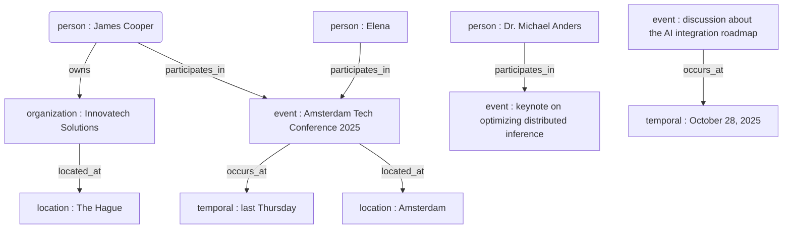

```json
{
  "entities": [
    { "id": "e1", "type": "person", "value": "Elena" },
    { "id": "e2", "type": "person", "value": "James Cooper" },
    { "id": "e3", "type": "person", "value": "Dr. Michael Anders" },
    { "id": "e4", "type": "organization", "value": "Innovatech Solutions" },
    { "id": "e5", "type": "location", "value": "Amsterdam" },
    { "id": "e6", "type": "location", "value": "Rotterdam" },
    { "id": "e7", "type": "location", "value": "The Hague" },
    { "id": "e8", "type": "temporal", "value": "October 28, 2025" },
    { "id": "e9", "type": "temporal", "value": "last Thursday" },
    { "id": "e10", "type": "event", "value": "Amsterdam Tech Conference 2025" },
    { "id": "e11", "type": "event", "value": "discussion about the AI integration roadmap" },
    { "id": "e12", "type": "event", "value": "keynote on optimizing distributed inference" },
    { "id": "e13", "type": "event", "value": "sprint review" }
  ]
}
```

```json
{
  "relationships": [
    { "id": "r1", "source": "e2", "relationship": "works_for", "target": "e4" },
    { "id": "r2", "source": "e4", "relationship": "located_at", "target": "e7" },
    { "id": "r3", "source": "e10", "relationship": "occurs_at", "target": "e9" },
    { "id": "r4", "source": "e10", "relationship": "located_at", "target": "e5" },
    { "id": "r5", "source": "e2", "relationship": "participates_in", "target": "e10" },
    { "id": "r6", "source": "e1", "relationship": "participates_in", "target": "e10" },
    { "id": "r7", "source": "e3", "relationship": "participates_in", "target": "e12" },
    { "id": "r8", "source": "e11", "relationship": "occurs_at", "target": "e8" }
  ]
}
```


