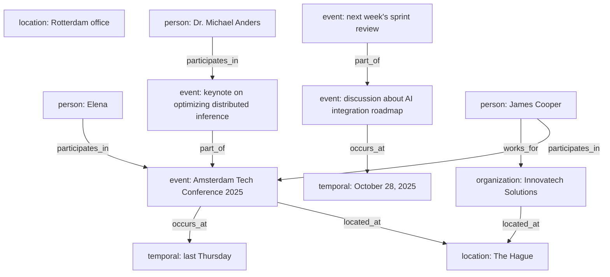

```mermaid
graph TB
e1[event: Amsterdam Tech Conference 2025]
e2[person: Elena]
e3[temporal: last Thursday]
e4[event: discussion about AI integration roadmap]
e5[temporal: October 28, 2025]
e6[location: Rotterdam office]
e7[person: Dr. Michael Anders]
e8[event: keynote on optimizing distributed inference]
e9[event: next week's sprint review]
e10[person: James Cooper]
e11[organization: Innovatech Solutions]
e12[location: The Hague]
e10 -->|works_for| e11
e11 -->|located_at| e12
e1 -->|occurs_at| e3
e4 -->|occurs_at| e5
e1 -->|located_at| e12
e8 -->|part_of| e1
e9 -->|part_of| e4
e10 -->|participates_in| e1
e2 -->|participates_in| e1
e7 -->|participates_in| e8
```