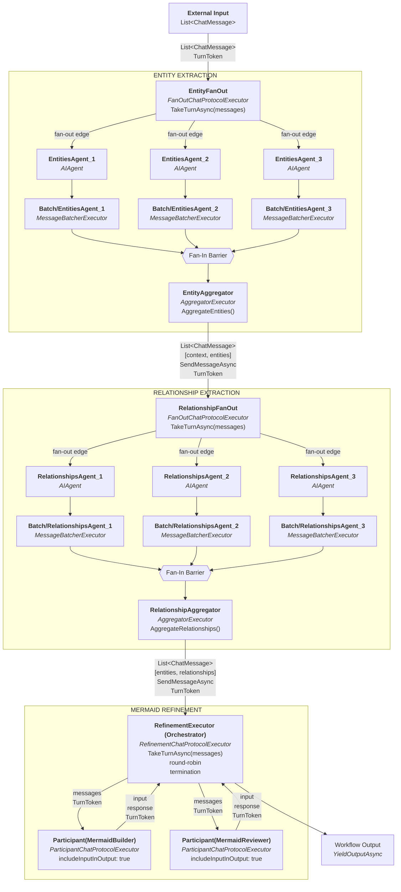
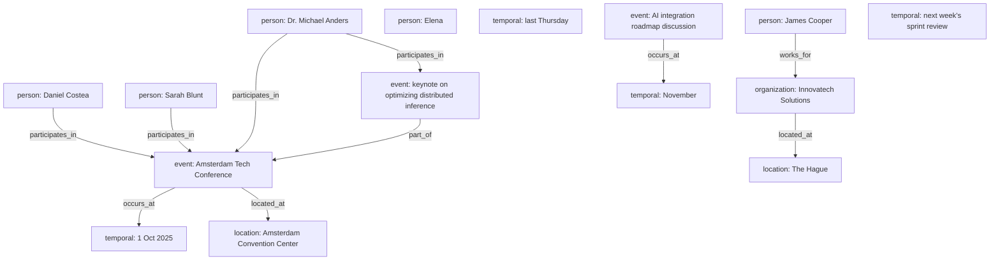
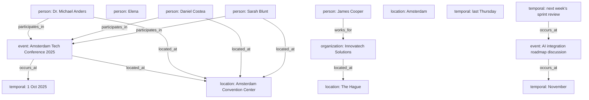

## Flow diagram

```mermaid
graph TD
    Input["<b>External Input</b><br/>List&lt;ChatMessage&gt;"]

    subgraph "ENTITY EXTRACTION"
        EFO["<b>EntityFanOut</b><br/><i>FanOutChatProtocolExecutor</i><br/>TakeTurnAsync(messages)"]
        
        EA1["<b>EntitiesAgent_1</b><br/><i>AIAgent</i>"]
        EA2["<b>EntitiesAgent_2</b><br/><i>AIAgent</i>"]
        EA3["<b>EntitiesAgent_3</b><br/><i>AIAgent</i>"]
        
        EB1["<b>Batch/EntitiesAgent_1</b><br/><i>MessageBatcherExecutor</i>"]
        EB2["<b>Batch/EntitiesAgent_2</b><br/><i>MessageBatcherExecutor</i>"]
        EB3["<b>Batch/EntitiesAgent_3</b><br/><i>MessageBatcherExecutor</i>"]
        
        BARRIER1{{"Fan-In Barrier"}}
        
        EAGG["<b>EntityAggregator</b><br/><i>AggregatorExecutor</i><br/>AggregateEntities()"]
    end

    subgraph "RELATIONSHIP EXTRACTION"
        RFO["<b>RelationshipFanOut</b><br/><i>FanOutChatProtocolExecutor</i><br/>TakeTurnAsync(messages)"]
        
        RA1["<b>RelationshipsAgent_1</b><br/><i>AIAgent</i>"]
        RA2["<b>RelationshipsAgent_2</b><br/><i>AIAgent</i>"]
        RA3["<b>RelationshipsAgent_3</b><br/><i>AIAgent</i>"]
        
        RB1["<b>Batch/RelationshipsAgent_1</b><br/><i>MessageBatcherExecutor</i>"]
        RB2["<b>Batch/RelationshipsAgent_2</b><br/><i>MessageBatcherExecutor</i>"]
        RB3["<b>Batch/RelationshipsAgent_3</b><br/><i>MessageBatcherExecutor</i>"]
        
        BARRIER2{{"Fan-In Barrier"}}
        
        RAGG["<b>RelationshipAggregator</b><br/><i>AggregatorExecutor</i><br/>AggregateRelationships()"]
    end

    subgraph "MERMAID REFINEMENT"
        HOST["<b>RefinementExecutor (Orchestrator)</b><br/><i>RefinementChatProtocolExecutor</i><br/>TakeTurnAsync(messages)<br/>round-robin<br/>termination"]
        BUILDER["<b>Participant(MermaidBuilder)</b><br/><i>ParticipantChatProtocolExecutor</i><br/>includeInputInOutput: true"]
        REVIEWER["<b>Participant(MermaidReviewer)</b><br/><i>ParticipantChatProtocolExecutor</i><br/>includeInputInOutput: true"]
    end

    Output["Workflow Output<br/><i>YieldOutputAsync</i>"]

    Input -->|"List&lt;ChatMessage&gt;<br/>TurnToken"| EFO
    EFO -->|"fan-out edge"| EA1
    EFO -->|"fan-out edge"| EA2
    EFO -->|"fan-out edge"| EA3
    EA1 --> EB1
    EA2 --> EB2
    EA3 --> EB3
    EB1 --> BARRIER1
    EB2 --> BARRIER1
    EB3 --> BARRIER1
    BARRIER1 --> EAGG

    EAGG -->|"List&lt;ChatMessage&gt;<br/>[context, entities]<br/>SendMessageAsync<br/>TurnToken"| RFO

    RFO -->|"fan-out edge"| RA1
    RFO -->|"fan-out edge"| RA2
    RFO -->|"fan-out edge"| RA3
    RA1 --> RB1
    RA2 --> RB2
    RA3 --> RB3
    RB1 --> BARRIER2
    RB2 --> BARRIER2
    RB3 --> BARRIER2
    BARRIER2 --> RAGG

    RAGG -->|"List&lt;ChatMessage&gt;<br/>[entities, relationships]<br/>SendMessageAsync<br/>TurnToken"| HOST

    HOST -->|"messages<br/>TurnToken"| BUILDER
    BUILDER -->|"input<br/>response<br/>TurnToken"| HOST
    HOST -->|"messages<br/>TurnToken"| REVIEWER
    REVIEWER -->|"input<br/>response<br/>TurnToken"| HOST

    HOST --> Output
```

## Entities and Relationships Diagram

### Run 1

```mermaid
graph TD                                               
e1[event: Amsterdam Tech Conference]                   
e2[temporal: 1 Oct 2025]                               
e3[person: Dr. Michael Anders]                         
e4[person: Daniel Costea]                              
e5[person: Sarah Blunt]                                
e6[location: Amsterdam Convention Center]              
e7[person: Elena]                                      
e8[temporal: last Thursday]                            
e9[event: AI integration roadmap discussion]           
e10[temporal: November]                                
e12[event: keynote on optimizing distributed inference]
e13[person: James Cooper]                              
e14[organization: Innovatech Solutions]                
e15[location: The Hague]                               
e16[temporal: next week's sprint review]               
e1 -->|occurs_at| e2                                   
e1 -->|located_at| e6                                  
e3 -->|participates_in| e1                             
e3 -->|participates_in| e12                            
e4 -->|participates_in| e1                             
e5 -->|participates_in| e1                             
e13 -->|works_for| e14                                 
e14 -->|located_at| e15                                
e9 -->|occurs_at| e10                                  
e12 -->|part_of| e1                                    
```

### Run 2

```mermaid
graph TD                                      
e1[event: Amsterdam Tech Conference 2025]     
e2[temporal: 1 Oct 2025]                      
e3[person: Dr. Michael Anders]                
e4[person: Elena]                             
e5[person: Daniel Costea]                     
e6[person: Sarah Blunt]                       
e7[person: James Cooper]                      
e8[organization: Innovatech Solutions]        
e9[location: The Hague]                       
e10[location: Amsterdam]                      
e11[location: Amsterdam Convention Center]    
e12[temporal: last Thursday]                  
e13[temporal: November]                       
e14[temporal: next week's sprint review]      
e15[event: AI integration roadmap discussion] 
                                              
e1 -->|occurs_at| e2                          
e1 -->|located_at| e11                        
e3 -->|participates_in| e1                    
e3 -->|located_at| e11                        
e5 -->|participates_in| e1                    
e5 -->|located_at| e11                        
e6 -->|participates_in| e1                    
e6 -->|located_at| e11                        
e7 -->|works_for| e8                          
e8 -->|located_at| e9                         
e15 -->|occurs_at| e13                        
e14 -->|occurs_at| e15                        
```