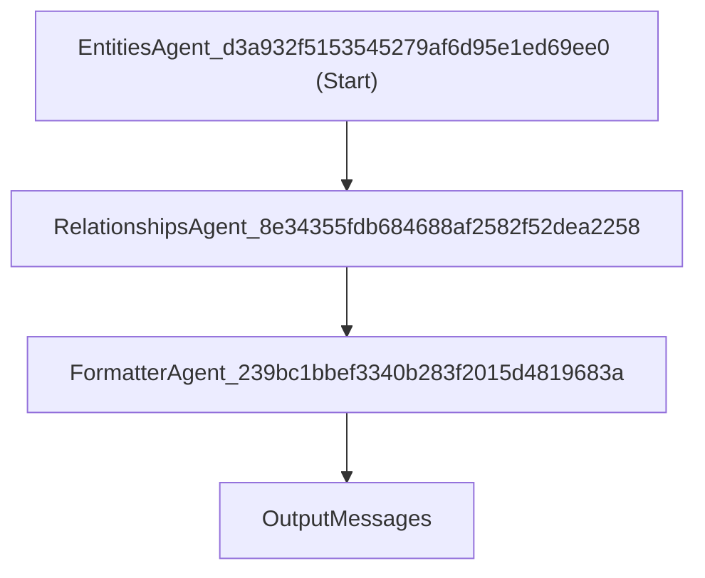

# Workflow Diagram

```mermaid
flowchart TD
  EntitiesAgent_d3a932f5153545279af6d95e1ed69ee0["EntitiesAgent_d3a932f5153545279af6d95e1ed69ee0 (Start)"];
  RelationshipsAgent_8e34355fdb684688af2582f52dea2258["RelationshipsAgent_8e34355fdb684688af2582f52dea2258"];
  FormatterAgent_239bc1bbef3340b283f2015d4819683a["FormatterAgent_239bc1bbef3340b283f2015d4819683a"];
  OutputMessages["OutputMessages"];
  EntitiesAgent_d3a932f5153545279af6d95e1ed69ee0 --> RelationshipsAgent_8e34355fdb684688af2582f52dea2258;
  RelationshipsAgent_8e34355fdb684688af2582f52dea2258 --> FormatterAgent_239bc1bbef3340b283f2015d4819683a;
  FormatterAgent_239bc1bbef3340b283f2015d4819683a --> OutputMessages;
```
