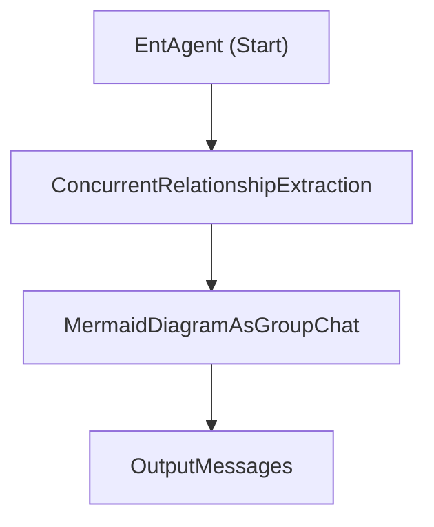
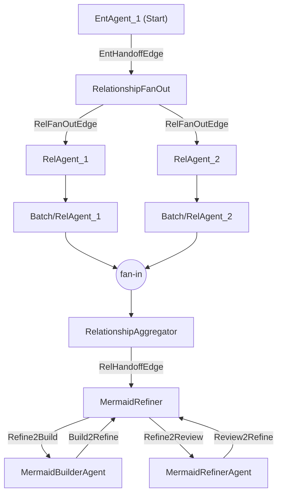
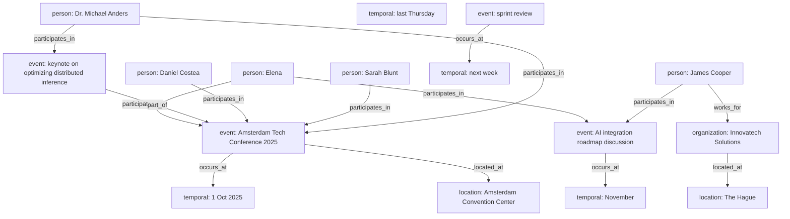
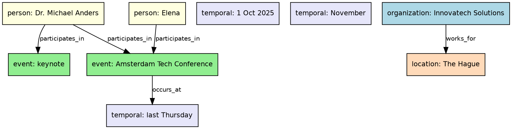

# Apex Agentic Entity Extractor

A progressive, hands-on learning project that teaches **multi-agent orchestration patterns** using the [Microsoft Agents AI Workflows SDK](https://learn.microsoft.com/dotnet/api/microsoft.agents.ai.workflows). Starting from a single "god" agent and incrementally decomposing it into concurrent fan-out/fan-in workflow and star-topology group chats — all the way to building a fully custom workflow graph from scratch.

> **Target audience:** developers who want to understand *how* the framework wires agents together — not just use the high-level helpers, but build the plumbing themselves.

---

## What This Project Teaches

The project solves a single problem (entity/relationship extraction → Mermaid diagram) using **three increasingly orchestration strategies**, each reusing the same agents but wiring them differently:

| # | Strategy | Orchestration Style | Key Concept |
|---|----------|-------------------|-------------|
| 0 | **Single Agent** | No workflow | One prompt does everything ("god" agent) |
| 1 | **Orchestration Patterns (High-Level)** | `WorkflowBuilder` + `Workflow.AsAIAgent` | Single entity agent; concurrent fan-out/fan-in for relationships; sub-workflows composed sequentially |
| 2 | **Fully Custom Workflow (Low-Level)** | Single flat `WorkflowBuilder` graph with all stages | No sub-workflows, no `AsAIAgent` — everything in one graph |

The progression from Strategy 0 → 2 mirrors a real-world evolution: start simple, decompose into specialised agents, then take full control of the execution graph.

---

## The Extraction Pipeline

Regardless of strategy, the logical flow is:

```
  Input (text + image)
              │
              ▼
┌─────────────────────────────┐
│  Stage 1: Entity Extraction │  1 agent
└─────────────┬───────────────┘
              │
              ▼
┌──────────────────────────────────┐
│  Stage 2: Relationship Extraction│  3 agents in parallel, deduplicate
└─────────────┬────────────────────┘
              │
              ▼
┌──────────────────────────────────┐
│  Stage 3: Mermaid Refinement     │  Builder ↔ Reviewer group chat
└─────────────┬────────────────────┘
              │
              ▼
         Mermaid Diagram
```

Entity and reviewer agents use **ontology tools** (loaded from JSON files and cached via `IDistributedCache`) to constrain outputs to permitted entity/relationship types.

---

## Mermaid Design Diagram - Patterns Versus Workflow

### Patterns diagram for Strategy 1 (high-level orchestration patterns with `AsAIAgent`):



### Workflow diagram for Strategy 2 (fully custom workflow with manual graph construction):



## Mermaid Diagram (sample)



## Key Framework Concepts

### Executor

The fundamental unit of work in a workflow graph. An executor is a **node** that receives typed messages, processes them, and sends typed messages downstream.

```
[Executor A] ──edge──→ [Executor B] ──edge──→ [Executor C]
```

Executors declare their message contracts via attributes:
- **`[MessageHandler]`** — marks a method as a handler for a specific message type. The framework's source generator discovers handlers by **parameter type**, not method name.
- **`[SendsMessage(typeof(T))]`** — declares this executor can send messages of type `T`.
- **`[YieldsOutput(typeof(T))]`** — declares this executor can yield final workflow output of type `T`.

The containing class must be `partial` (for source generation) and derive from `Executor`.

**Valid handler signatures** (from the framework docs):
```
void Handler(TMessage, IWorkflowContext)
void Handler(TMessage, IWorkflowContext, CancellationToken)
ValueTask Handler(TMessage, IWorkflowContext)
ValueTask Handler(TMessage, IWorkflowContext, CancellationToken)
TResult Handler(TMessage, IWorkflowContext)
ValueTask<TResult> Handler(TMessage, IWorkflowContext, CancellationToken)
```

> **Note:** `IWorkflowContext` is always required in the signature, even if unused — it's a framework constraint enforced by the source generator.

### Edge

A **directed connection** between two executors (or between an executor and an `AIAgent`). Edges define message routes — when executor A sends a message, it travels along all outgoing edges to reach connected executors.

Edge types used in this project:
- **`AddEdge(source, target)`** — standard directed edge.
- **`AddFanOutEdge(source, [targets])`** — broadcasts messages from one source to multiple targets.
- **`AddFanInBarrierEdge([sources], target)`** — waits for all sources to complete before delivering to target.

### AIAgent

The framework's abstraction for an LLM-backed agent. Created via `IChatClient.AsAIAgent(options)` with a name, system instructions, tools, and chat options. In a workflow graph, an `AIAgent` is wrapped as an executor internally by the framework.

### ExecutorBinding

A handle to an executor's identity within the graph. Used when you need to reference an executor by its `Id` — for example, in **targeted sends** where you route a message to a specific executor rather than broadcasting to all edges:

```csharp
await context.SendMessageAsync(messages, targetExecutor.Id, cancellationToken);
```

### TurnToken

A coordination signal — **not** a data message. Executors that use the **two-phase protocol** (buffer data first, act on `TurnToken`) use this to separate "data has arrived" from "now process it." This prevents premature execution on partial input in fan-out scenarios.

### WorkflowBuilder vs AgentWorkflowBuilder

| | `AgentWorkflowBuilder` | `WorkflowBuilder` |
|---|---|---|
| **Level** | High-level helpers | Low-level graph API |
| **Creates** | `BuildSequential`, `BuildConcurrent`, `CreateGroupChatBuilderWith` | Manual `AddEdge`, `AddFanOutEdge`, `AddFanInBarrierEdge` |
| **Control** | Framework wires executors/edges internally | You create every executor and edge explicitly |
| **When to use** | Standard patterns suffice | Custom topologies, targeted sends, inter-stage handoffs |

### Workflow.AsAIAgent

Wraps an entire `Workflow` as a single `AIAgent`. This enables **workflow composition** — an inner workflow with complex topology appears as one agent from the outer workflow's perspective.

### IResettableExecutor & Cross-Run State

Executors declared with `declareCrossRunShareable: true` persist across workflow runs for reuse. They implement `IResettableExecutor` to clear mutable state between runs, preventing stale data leakage.

---

## Orchestration Strategies In Detail

### Strategy 0 — Single Agent (`/extract/agents/solo`)

A single "god" agent with one monolithic prompt handles entity extraction, relationship extraction, and diagram generation in a single LLM call.

**Pros:** Simplest possible implementation.  
**Cons:** No parallelism, no specialisation, prompt bloat, hard to iterate on individual stages.

### Strategy 1 — High-Level Orchestration Patterns (`/extract/patterns`)

Built by `BuildHighLevelPatterns`. Entity extraction uses a single agent; relationship extraction is a concurrent workflow (2 agents in parallel) built with `AgentWorkflowBuilder` high-level helpers and wrapped via `Workflow.AsAIAgent`:

```
[EntityAgent] ──→ [BuildConcurrent → AsAIAgent] ──→ [GroupChat → AsAIAgent] ──→ Output
```

The outer workflow uses `BuildSequential` — it doesn't know (or care) that each "agent" is actually a full concurrent workflow internally.

### Strategy 2 — Fully Custom Pipeline (`/extract/workflows`)

Built by `BuildLowLevelFullCustomWorkflow`. All three stages live in a **single flat `WorkflowBuilder` graph** — no sub-workflows, no `AsAIAgent`.

```
                              ┌──→ [Rel_1] ──→ [Batcher] ──┐
  [Entity Agent] ──→ [Rel Fan-Out] ──┤                         ├──→ [Rel Aggregator]
                              └──→ [Rel_2] ──→ [Batcher] ──┘          │
                                                                       ▼
              [RefinementExecutor] ←──→ [Builder / Reviewer] ──→ Output
```

This requires **forwarding aggregators** (`AggregatorExecutor`) instead of terminal ones — they send `List<ChatMessage>` + `TurnToken` downstream rather than yielding output, keeping all stages inside the same graph.

In the refinement stage, participant executors run with `includeInputInOutput: false`, and `RefinementExecutor` composes clean per-turn conversations from a captured base context (`_baseContext`) plus the latest builder/reviewer response. This avoids context bloat and response parroting across turns.

---

## Custom Executors

| Executor | Role | Two-Phase | Agent-Fueled |
|---|---|---|---|
| `FanOutExecutor` | Broadcasts buffered messages to all downstream edges | ✅ | ❌ |
| `BatcherExecutor` | Stateless relay — gives each branch a distinct identity for the barrier | ❌ | ❌ |
| `AggregatorExecutor` | Forwarding fan-in — merges N results and sends downstream | ❌ | ❌ |
| `ParticipantExecutor` | Wraps an `AIAgent` — streams responses and forwards results | ✅ | ✅ |
| `RefinementExecutor` | Star-topology hub — manages turn-taking, termination, output selection | ✅ | Hybrid |

### Two-Phase Message Protocol

Three of five executors buffer data in phase 1 (sync handler) and act in phase 2 (async `TurnToken` handler):

```
Phase 1: HandleMessages(List<ChatMessage>) → _messages = messages;     // sync, just buffer
Phase 2: HandleTurnAsync(TurnToken)        → process and send/yield    // async, does the work
```

`AggregatorExecutor` is self-triggered (fires when its count threshold is reached) and does not use `TurnToken`.

### The Swap-and-Clear Pattern

Every stateful executor uses the same pattern to prevent reprocessing:

```csharp
List<ChatMessage> messages = _messages;   // move reference to local
_messages = [];                            // clear field immediately
// ... work with local 'messages' ...
```

---

## Project Structure

```
Apex.AgenticEntityExtractor/
├── Controllers/
│   └── ExtractorController.cs        # API endpoints (one per strategy)
├── Agents/
│   ├── IExtractorAgentsBuilder.cs    # Agent factory interface
│   └── ExtractorAgentsBuilder.cs     # Creates AIAgents with instructions + tools
├── Workflows/
│   ├── IExtractorWorkflowBuilder.cs  # Workflow factory interface
│   └── ExtractorWorkflowBuilder.cs   # Both strategies
├── Executors/
│   ├── FanOutExecutor.cs             # Fan-out entry point
│   ├── BatcherExecutor.cs            # Per-branch barrier identity
│   ├── AggregatorExecutor.cs         # Forwarding fan-in (intermediate)
│   ├── ParticipantExecutor.cs        # AIAgent wrapper for group chats
│   └── RefinementExecutor.cs         # Star-topology group chat hub
├── Aggregators/
│   └── Aggregator.cs                 # Deduplication and merge logic
├── GroupChatManagers/
│   └── ApprovalManager.cs            # Public adapter for RoundRobinGroupChatManager + termination logic
├── Helpers/
│   └── MessageHelper.cs              # Builds ChatMessage from extraction request
├── Clients/
│   ├── IExtractorChatClientBuilder.cs
│   └── ExtractorChatClientBuilder.cs # Multi-provider chat client factory
├── Enums/
│   └── ChatProvider.cs               # Ollama, OpenAI, AzureOpenAI, Anthropic
├── Middleware/
│   └── ToolResponseMiddleware.cs     # IDistributedCache-based tool response caching
├── Tools/
│   └── OntologyTools.cs              # Loads entity/relationship ontologies from JSON
├── OutputRenderers/
│   ├── PayloadHelper.cs              # JSON/Mermaid extraction utilities
│   ├── WorkflowHelper.cs             # Workflow event stream processing
│   ├── IWorkflowRenderer.cs          # UI abstraction for workflow rendering
│   ├── SpectreWorkflowRenderer.cs    # Spectre.Console renderer implementation
│   ├── WorkflowConsoleRenderer.cs    # Console renderer implementation
│   ├── IDashboardSession.cs          # Dashboard session abstraction
│   ├── SpectreDashboardSession.cs    # Spectre dashboard session
│   └── DashboardState.cs             # Dashboard view model/state container
├── Models/                           # Entity, Relationship, EntityType, etc.
├── Data/
│   ├── Input/                        # Default input text + image
│   ├── Instructions/                 # Agent system prompts (markdown)
│   └── Ontology/                     # Permitted entity/relationship types (JSON)
└── Program.cs                        # DI, DevUI registration, Swagger
```

---

## Configuration

### Provider Selection

Set the active provider in `appsettings.json`:

```json
{
  "Provider": "AzureOpenAI",
  "ToolResponseCacheTTL": "01:00:00"
}
```

Supported providers: `Ollama`, `OpenAI`, `Smaller_OpenAI`, `AzureOpenAI`, `Anthropic`.

### API Keys

Use [User Secrets](https://learn.microsoft.com/aspnet/core/security/app-secrets) for sensitive values:

```bash
dotnet user-secrets set "AzureOpenAI:Endpoint" "https://your-resource.openai.azure.com/"
dotnet user-secrets set "AzureOpenAI:ApiKey" "your-key"
dotnet user-secrets set "AzureOpenAI:DeploymentName" "gpt-4o"
```

Or for OpenAI:

```bash
dotnet user-secrets set "OpenAI:ApiKey" "sk-..."
dotnet user-secrets set "OpenAI:ModelId" "gpt-4o"
```

---

## Running the Application

```bash
cd Apex.AgenticEntityExtractor
dotnet run
```

The app starts as an ASP.NET Core Web API with:
- Swagger UI at `https://localhost:<port>/swagger`
- DevUI at `https://localhost:<port>/devui` (development environment)

It also maps OpenAI-compatible responses and conversation endpoints via:
- `app.MapOpenAIResponses()`
- `app.MapOpenAIConversations()`

### API Endpoints

| Endpoint | Strategy | Description |
|---|---|---|
| `POST /extract/agents/solo` | 0 | Single "god" agent |
| `POST /extract/patterns` | 1 | High-level orchestration patterns (concurrent sub-workflows) |
| `POST /extract/workflows` | 2 | Fully custom single workflow |

All endpoints accept `multipart/form-data` with optional `InputText` (string) and `InputImage` (file). When omitted, defaults from `Data/Input/` are used.

---

## Tech Stack

- **.NET 10** / ASP.NET Core
- **Microsoft.Agents.AI.OpenAI** `1.0.0-rc3` and **Microsoft.Agents.AI.Anthropic** `1.0.0-rc3`
- **Microsoft.Agents.AI.Workflows.Generators** `1.0.0-rc3` — workflow source generation for executors
- **Microsoft.Extensions.AI.AzureAIInference** `10.0.0-preview.1.25559.3`
- **Azure.AI.OpenAI** `2.8.0-beta.1` / **OllamaSharp** `5.4.23`
- **Microsoft.Agents.AI.DevUI** `1.0.0-preview.260304.1`
- **Spectre.Console** + **Spectre.Console.ImageSharp** `0.54.1-alpha.0.68`
- **Swashbuckle** — Swagger UI

---

## References

- [Microsoft Agents AI Workflows SDK](https://learn.microsoft.com/dotnet/api/microsoft.agents.ai.workflows) — API reference
- [`MessageHandlerAttribute`](https://learn.microsoft.com/dotnet/api/microsoft.agents.ai.workflows.messagehandlerattribute) — handler signature rules
- [`AgentWorkflowBuilder`](https://learn.microsoft.com/dotnet/api/microsoft.agents.ai.workflows.agentworkflowbuilder) — high-level workflow helpers
- [`WorkflowBuilder`](https://learn.microsoft.com/dotnet/api/microsoft.agents.ai.workflows.workflowbuilder) — low-level graph API
- [`Executor`](https://learn.microsoft.com/dotnet/api/microsoft.agents.ai.workflows.executor) — base executor class
- [Microsoft.Extensions.AI](https://learn.microsoft.com/dotnet/api/microsoft.extensions.ai) — `IChatClient` and `ChatMessage`
- [Agents SDK GitHub repository](https://github.com/microsoft/Agents-SDK) — source code and samples

---


## Visualize DOT diagerams with [Graphviz Online](https://dreampuf.github.io/GraphvizOnline/) or [Graphviz Visual Editor](https://magjac.com/graphviz-visual-editor/):

